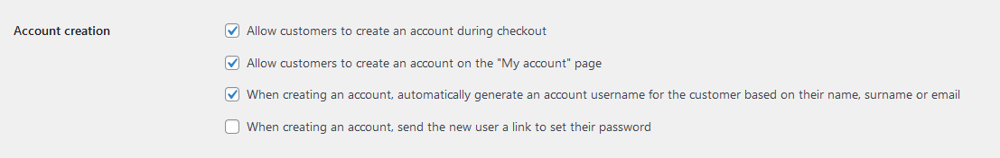
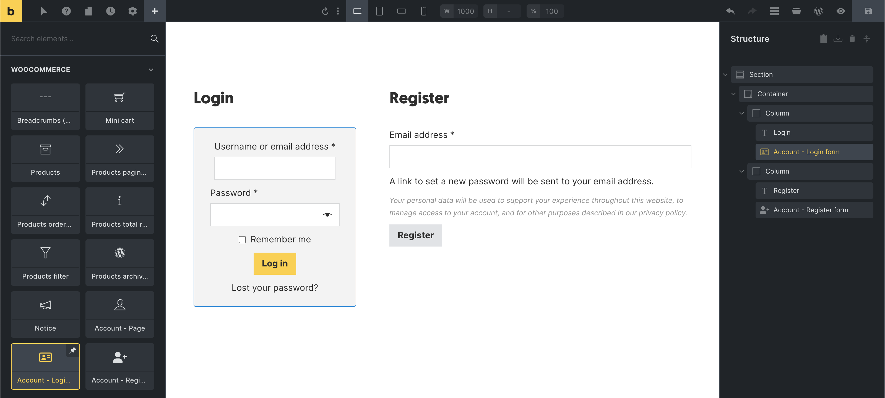
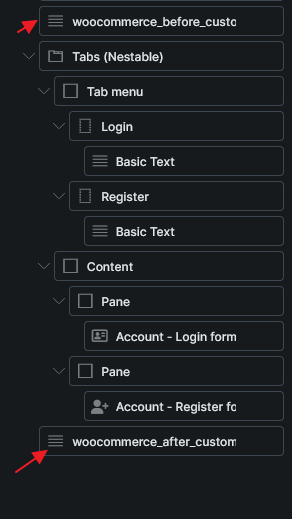
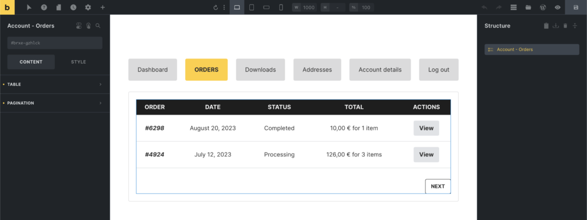

Bricks 1.9 introduces the My Account builder, which lets you customize the account area of your WooCommerce site.

This includes the My Account page (logged-in), the account login/register/lost & reset password pages (shown when not logged-in), and all My Account endpoints (e.g., Orders, Downloads, etc.).

:::note
Starting in Bricks 2.4, you can also build the My Account page directly with [WooCommerce advanced modular elements](/integrations/woocommerce/advanced-modular-elements/) and the [Account Page v2 element](/builder/elements/woocommerce/account-page-v2/). The classic account template workflow below is still supported.
:::

:::note
**IMPORTANT:** In order to ensure that all your customizations to the WooCommerce My Account templates are properly applied, it is imperative that you complete the "[My Account Page (logged in)](#my-account-page)" step.
:::

## Account Page v2 workflow

With advanced modular elements enabled, Account Page v2 keeps the account wrapper, navigation, login state, password states, and account endpoint states together on the assigned My Account page.

Use the [Woo Setup Wizard](/integrations/woocommerce/woo-setup-wizard/) and choose **Advanced (v2)** to replace the assigned My Account page content with the Account Page v2 element and generated state structure.

Account Page v2 includes states for:

- Dashboard
- Orders
- View order
- Downloads
- Addresses
- Edit address
- Edit account
- Payment methods
- Add payment method
- Login
- Lost password
- Lost password confirmation
- Reset password

Each state can generate a complete starter block through **Insert a structure**. Address and account forms use editable Bricks form field elements, so you can style and reorder them after generation.

The Account edit-address state has its own field sync because WooCommerce account address editing and checkout use different field contexts. Use it after plugins or WooCommerce settings change address fields.

Account Page v2 also adds query loops and dynamic tags for account orders, order actions, account downloads, account addresses, order data, downloads, and customer notes. See [WooCommerce v2 query loops and dynamic tags](/integrations/woocommerce/woocommerce-v2-query-loops-dynamic-tags/#account-tags).

### Endpoints added by plugins

Account Page v2 provides editable states for the built-in WooCommerce account routes listed above. An endpoint registered by another plugin does not appear automatically as an additional editable state in the builder.

WooCommerce account endpoints are routes on the assigned My Account page, not separate WordPress pages. A plugin that registers an endpoint and its output callback correctly can still render its content through WooCommerce on that page, but Bricks does not provide a dedicated Account Page v2 state for designing that endpoint.

If a plugin endpoint is blank on the frontend, temporarily test the My Account page with WooCommerce's default account output or without the Account Page v2 element. If it remains blank, check the plugin's endpoint registration. If it works only without Account Page v2, include the plugin name and endpoint slug when contacting Bricks support.

## My Account Page (logged in) {#my-account-page}

To design your My Account page (navigation + content wrapper), **please edit your "My Account" page directly**. You'll find a dedicated "Account Page" element that you can add and adjust its settings to your liking.

<figcaption>

Custom My Account page using the "Account - Page" element

</figcaption>

:::note
**IMPORTANT:** If you have the *"Enable Bricks WooCommerce "Notice" element"* Bricks setting enabled, please make sure that you have added the "Notice" element to your account page or to all account templates individually. So the notifications when submitting the account forms (e.g., address, reset password, etc.) are displayed.
:::

## Account - Login / Register {#my-account-login-register}

The login form is displayed when a not-logged-in visitor views the My Account page. And the registration form, if you have the *"Allow customers to create an account on the "My account" page"* WooCommerce setting enabled.

You can design your account login/registration layout by creating a new template type "WooCommerce - Account - Login".

When editing this template, you'll find dedicated elements for the **"Account - Login form"** & **"Account - Register form"** as shown in the screenshot below:

You should also check the **Account creation** settings located at *WooCommerce > Settings > Accounts & Privacy* section to control what form to be displayed via **Account - Register form** element.

<figcaption>

Custom account login/register template

</figcaption>

:::note
**IMPORTANT:** Ensure you have inserted a Basic Text element with `{do_action:woocommerce_before_customer_login_form}` before your Login and Register form. And another Basic Text element with `{do_action:woocommerce_after_customer_login_form}` after the forms.
:::

<figcaption>

Example do_action location. Before and after the login/register forms.

</figcaption>

## Account - Lost / reset password {#my-account-lost-reset-password}

The WooCommerce account builder in Bricks also provides the following dedicated templates and elements for the lost & reset password pages:

| **Account page** | **Template type** | **Elements** |
| --- | --- | --- |
| Lost password | WooCommerce - Account - Lost password | Account - Lost password |
| Lost password confirmation | WooCommerce - Account - Lost password (Confirmation) | Displayed after submitting the lost password form. No special elements.  Example: *A password reset email has been sent to the email address on file for your account, but may take several minutes to show up in your inbox. Please wait at least 10 minutes before attempting another reset.* |
| Reset password | WooCommerce - Account - Reset password | Account - Reset password |

## Templates for specific account endpoints {#my-account-endpoints}

Designing the account content area for individual account endpoints (Orders, Downloads, etc.) is possible by creating templates of the corresponding template type.

In the example below, we created a "WooCommerce - Account - Orders" template, to which we then added the "Account - Orders" that we styled a bit.

:::note
When editing the template for an account endpoint (Orders, Downloads, etc.), the drag & drop area is located inside the account content area. Offering a better preview in the builder than just rendering an empty canvas without the account navigation.
:::

The process of creating those account endpoint templates is the same for all other WooCommerce account template types.

## Account template types & elements

| **Template type** | **Endpoint** | **Element** |
| --- | --- | --- |
| WooCommerce - Account - Dashboard | `/` | - |
| WooCommerce - Account - Orders | `orders/` | Account - Orders |
| WooCommerce - Account - View order | `view-order/{order_id}/` | Account - View order |
| WooCommerce - Account - Downloads | `downloads/` | Account - Downloads |
| WooCommerce - Account - Payment methods | `payment-methods/` | Account - Payment methods |
| WooCommerce - Account - Add payment method | `add-payment-method/` | Account - Add payment method |
| WooCommerce - Account - Addresses | `edit-address/` | Account - Addresses |
| WooCommerce - Account - Edit address | `edit-address/billing/` `edit-address/shipping/` | Account - Edit address |
| WooCommerce - Account - Edit account | `edit-account/` | Account - Edit account |
