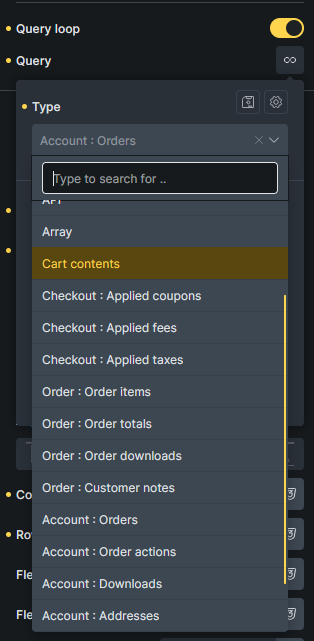
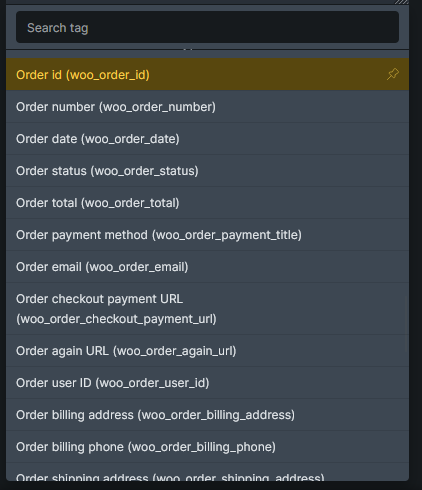

Bricks 2.4 adds WooCommerce-specific query loops and dynamic tags for advanced modular Cart, Checkout, and My Account layouts.

Use them when you build with [WooCommerce advanced modular elements](/integrations/woocommerce/advanced-modular-elements/), or when you need a custom cart-dependent layout such as a mini cart inside the [Dynamic fragment element](/builder/elements/woocommerce/dynamic-fragment/).

:::note
Advanced v2 query loops and dynamic tags require **Bricks > Settings > WooCommerce > Enable advanced modular elements**. The existing **Cart contents** query loop remains available for the classic cart workflow.
:::

## Query loops

Use these query loop types from the **Query type** control. `wooCart` is the existing Cart contents loop. The other query types are added for advanced modular layouts and only appear when advanced modular elements are enabled.



| Query type               | Builder label              | Use it for                                                                 |
| ------------------------ | -------------------------- | -------------------------------------------------------------------------- |
| `wooCart`                | Cart contents              | Visible cart line items. Use for cart rows and custom mini cart item rows. |
| `wooCartCoupons`         | Checkout : Applied coupons | Applied cart coupons.                                                      |
| `wooCartFees`            | Checkout : Applied fees    | Cart fees.                                                                 |
| `wooCartTaxes`           | Checkout : Applied taxes   | Cart tax rows.                                                             |
| `wooOrderItems`          | Order : Order items        | Line items from the current order context.                                 |
| `wooOrderTotals`         | Order : Order totals       | Order total rows from the current order context.                           |
| `wooOrderDownloads`      | Order : Order downloads    | Downloadable items from the current order context.                         |
| `wooOrderCustomerNotes`  | Order : Customer notes     | Customer notes from the current order context.                             |
| `wooAccountOrders`       | Account : Orders           | Customer orders in the Account orders state.                               |
| `wooAccountOrderActions` | Account : Order actions    | Available actions for the current order inside a `wooAccountOrders` loop.  |
| `wooAccountDownloads`    | Account : Downloads        | Downloads available to the current account.                                |
| `wooAccountAddresses`    | Account : Addresses        | Billing and shipping address rows in the Account addresses state.          |

Order loops use the current order context. That context exists in Checkout v2 pay, thank-you, and order receipt states, in Account v2 view-order states, and inside order-aware account loops.

:::note
Order-related query loops are compatible with WooCommerce HPOS because they use WooCommerce order APIs and `WC_Order` objects. If you add custom code around these loops, use WooCommerce CRUD functions such as `wc_get_orders()` and `wc_get_order()` instead of direct `shop_order` post or postmeta queries.
:::

## Cart tags

Use these tags inside the `wooCart` query loop:

- `{woo_cart_product_name}` - Cart item product name, including WooCommerce cart item metadata.
- `{woo_cart_product_title}` - Product title without variation attributes or other cart item metadata. Add `:plain` to remove the product link.
- `{woo_cart_item_price}` - Formatted unit price. A discounted item includes the regular price and current price using WooCommerce sale-price markup. Add `:value` for the unformatted current unit price.
- `{woo_cart_item_save}` - Formatted product savings for the full line item quantity. Add `:value` for the unformatted savings amount or `:percentage` for the numeric discount percentage without a percent symbol.
- `{woo_cart_remove_link}` - Remove link markup. Use `{woo_cart_remove_link:url}` when you only need the remove URL.
- `{woo_cart_quantity}` - Quantity input. Use `{woo_cart_quantity:value}` for the numeric quantity.
- `{woo_cart_subtotal}` - Cart line subtotal.

You can also use product tags inside the `wooCart` loop, such as `{featured_image}`, `{woo_product_price}`, `{woo_product_sku}`, and `{woo_product_gtin}`.

Use `{woo_cart_product_title}` when the product title and item details need separate elements or styling. The existing `{woo_cart_product_name}` remains available for layouts that rely on its combined output, including item metadata, backorder notices, and WooCommerce cart item hooks.

`{woo_cart_item_price}` uses the current cart item product or variation and follows the store's cart tax display setting. `{woo_cart_item_save}` compares that unit price with the regular price, then multiplies the monetary savings by the cart item quantity.

:::note
Cart item savings only cover a product's regular-price reduction. Coupon discounts, fees, shipping, and other cart or order-level adjustments are not included. The savings tags return no value when the product has no regular price or the current price is not lower.
:::

## Cart item data element

Add the **Cart item data** element inside a **Cart contents** query loop to render variation attributes and item data separately from the product title.

The element includes variation attributes even when their values appear in the variation name. It also includes compatible data added through WooCommerce's `woocommerce_get_item_data` filter and preserves safe formatted display values supplied by extensions.

Use these controls to design the output:

- **Show labels** and **Label suffix**. The default suffix is `:`.
- **Show separators** and **Separator**. The default separator is `/`.
- **Layout** controls for direction, wrapping, alignment, justification, and row and column gaps.
- **Item** controls for direction, alignment, gap, padding, background, border, and box shadow.
- **Label** and **Value** controls for width, flex grow and shrink, spacing, background, border, box shadow, and typography.
- **Separator** typography and margin.

The element renders nothing on the frontend when used outside a Cart contents loop or when the current item has no item data.

## Cart totals and checkout tags

These tags can be used in cart, checkout, and cart-dependent fragments without being inside the `wooCart` loop:

- `{woo_cart_items_count}`
- `{woo_cart_order_subtotal}`
- `{woo_cart_order_total}`
- `{woo_cart_applied_coupon_total_amount}`
- `{woo_cart_applied_fee_total_amount}`
- `{woo_cart_shipping_method}`
- `{woo_cart_shipping_total_amount}`
- `{woo_free_shipping_min_amount}`
- `{woo_free_shipping_remaining}`
- `{woo_free_shipping_progress}`
- `{woo_checkout_current_step_number}`
- `{woo_url}`

Some tags support `:value` to return a plain number instead of formatted WooCommerce HTML, such as `{woo_cart_shipping_total_amount:value}` and `{woo_free_shipping_progress:value}`.

## Coupon, fee, and tax tags

| Query loop       | Tags                                                            |
| ---------------- | --------------------------------------------------------------- |
| `wooCartCoupons` | `{woo_cart_applied_coupon}`, `{woo_cart_applied_coupon_amount}` |
| `wooCartFees`    | `{woo_cart_applied_fee}`, `{woo_cart_applied_fee_amount}`       |
| `wooCartTaxes`   | `{woo_cart_applied_tax_label}`, `{woo_cart_applied_tax_amount}` |

Use the total tags outside the loop when you only need a combined value:

- `{woo_cart_applied_coupon_total_amount}`
- `{woo_cart_applied_fee_total_amount}`

## WooCommerce URL tag

Use `{woo_url}` to output common WooCommerce page and endpoint URLs. Without a key, it returns the shop URL.

| Tag                                               | Returns                                    |
| ------------------------------------------------- | ------------------------------------------ |
| `{woo_url}` or `{woo_url:shop}`                   | Shop page URL                              |
| `{woo_url:cart}`                                  | Cart page URL                              |
| `{woo_url:checkout}`                              | Checkout page URL                          |
| `{woo_url:account}` or `{woo_url:myaccount}`      | My Account page URL                        |
| `{woo_url:dashboard}`                             | My Account dashboard endpoint URL          |
| `{woo_url:orders}`                                | My Account orders endpoint URL             |
| `{woo_url:downloads}`                             | My Account downloads endpoint URL          |
| `{woo_url:addresses}` or `{woo_url:edit-address}` | My Account edit-address endpoint URL       |
| `{woo_url:edit-account}`                          | My Account edit-account endpoint URL       |
| `{woo_url:payment-methods}`                       | My Account payment methods endpoint URL    |
| `{woo_url:add-payment-method}`                    | My Account add payment method endpoint URL |
| `{woo_url:lost-password}`                         | My Account lost password endpoint URL      |
| `{woo_url:customer-logout}`                       | My Account logout endpoint URL             |
| `{woo_url:terms}`                                 | WooCommerce terms and conditions page URL  |
| `{woo_url:privacy}`                               | WooCommerce privacy policy page URL        |

Registered WooCommerce account endpoint query vars can also be resolved by key. This only returns a URL; it does not add custom Account v2 states.

## Account tags

Use these tags in Account v2 states.

| Context                          | Tags                                                                                                                                                                                              |
| -------------------------------- | ------------------------------------------------------------------------------------------------------------------------------------------------------------------------------------------------- |
| Account addresses state          | `{woo_account_addresses_description}`                                                                                                                                                             |
| `wooAccountAddresses` query loop | `{woo_account_address_type}`, `{woo_account_address_title}`, `{woo_account_address}`, `{woo_account_address_has_address}`, `{woo_account_address_edit_url}`, `{woo_account_address_action_label}` |
| Account edit-address state       | `{woo_account_edit_address_title}`, `{woo_account_edit_address_type}`, `{woo_account_edit_address_type_label}`                                                                                    |

## Order tags

Use these tags in Checkout v2 order states, Account v2 order states, or order-aware query loops.



General order tags:

- `{woo_order_id}`
- `{woo_order_number}`
- `{woo_order_date}`
- `{woo_order_status}`
- `{woo_order_total}`
- `{woo_order_payment_title}`
- `{woo_order_email}`
- `{woo_order_checkout_payment_url}`
- `{woo_order_again_url}`
- `{woo_order_user_id}`
- `{woo_order_billing_address}`
- `{woo_order_billing_phone}`
- `{woo_order_shipping_address}`
- `{woo_order_shipping_phone}`
- `{woo_order_view_url}`
- `{woo_order_view_aria_label}`
- `{woo_order_item_count}`
- `{woo_order_total_with_item_count}`

Use these inside `wooOrderItems`:

- `{woo_order_item_name}`
- `{woo_order_item_title}` - Product title without variation metadata. Add `:plain` to remove the product link.
- `{woo_order_item_quantity}`
- `{woo_order_item_price}`
- `{woo_order_item_line_subtotal}`
- `{woo_order_item_meta}`

Use `{woo_order_item_title}` with the **Order item data** element when the title and persisted order metadata need separate styling. If the original product has been deleted, the title tag falls back to the item name stored with the order.

Add the **Order item data** element inside an **Order : Order items** query loop. It renders persisted variation and other formatted order item metadata in Checkout v2 Pay, Thank you, and Order receipt states, the Account v2 View order state, and an Order items loop nested inside **Account : Orders**.

The Cart item data and Order item data elements have the same controls, but they use different data sources. Cart item data comes from the active cart. Order item data comes from the saved order item and runs WooCommerce's formatted metadata filters.

:::note
Use `{woo_order_item_meta}` when an extension depends on WooCommerce's complete order-item metadata output or its start, end, and display hooks. The structured **Order item data** element does not run arbitrary complete-output hooks because their markup cannot be split reliably across the element's Label and Value controls.
:::

For custom CSS, the elements use separate class prefixes:

| Output    | Cart item data                   | Order item data                   |
| --------- | -------------------------------- | --------------------------------- |
| Root      | `.brx-cart-item-data`            | `.brx-order-item-data`            |
| Item      | `.brx-cart-item-data__item`      | `.brx-order-item-data__item`      |
| Label     | `.brx-cart-item-data__label`     | `.brx-order-item-data__label`     |
| Value     | `.brx-cart-item-data__value`     | `.brx-order-item-data__value`     |
| Separator | `.brx-cart-item-data__separator` | `.brx-order-item-data__separator` |

Each item also receives a metadata-key modifier class, such as `.brx-cart-item-data__item--color`, and a matching `data-key` attribute.

Use these inside `wooOrderTotals`:

- `{woo_order_total_label}`
- `{woo_order_total_value}`

Use these inside `wooAccountOrderActions`, usually inside a `wooAccountOrders` loop:

- `{woo_order_action_url}`
- `{woo_order_action_name}`
- `{woo_order_action_aria_label}`

Use these inside `wooOrderDownloads` or `wooAccountDownloads`:

- `{woo_order_download_product}`
- `{woo_order_download_name}`
- `{woo_order_download_url}`
- `{woo_order_downloads_remaining}`
- `{woo_order_download_access_expires}`

Use these inside `wooOrderCustomerNotes`:

- `{woo_order_customer_note_date}`
- `{woo_order_customer_note_comment}`

## Conditions

Bricks 2.4 adds WooCommerce conditions for checkout and order-aware layouts:

- **Checkout : Login step needed**
- **Checkout : Needs shipping**
- **Checkout : Needs shipping address**
- **Checkout : Order has status**
- **Order : Needs shipping address**
- **Order : Has downloads**

Use them to show or hide content inside checkout steps, thank-you/order receipt layouts, view-order screens, and other checkout or order-aware sections.

**Checkout : Login step needed** returns **Yes** only for logged-out customers when **Enable log-in during checkout** is enabled in WooCommerce. The generated [Checkout v2 multistep checkout](/integrations/woocommerce/multistep-checkout-v2/#account-login-step-visibility) uses this condition to hide its Account Login step and related navigation when that step is not available.

Use **Checkout : Needs shipping** for shipping methods and for a complete Shipping step. It returns **Yes** when the non-empty cart contains products that require shipping. In a multistep checkout, apply it to both the Shipping step and the matching navigation item.

Use **Checkout : Needs shipping address** for the **Ship to another address** control and the shipping-address fields. When WooCommerce is set to force shipping to the billing address, this condition returns **No** even if the cart still needs shipping.

See [Element Conditions](/builder/features/element-conditions/#woocommerce) for condition setup and comparison behavior.

## Interactions

Advanced modular WooCommerce layouts also add two interaction triggers:

- **Bricks dynamic fragments refreshed** - Runs after Dynamic fragment content has been refreshed.
- **Bricks checkout step changed** - Runs after a Checkout v2 step changes.

The **Checkout step** interaction action can move a multistep checkout to the next step, previous step, a specific step, or a specific checkout field. It can also scroll the target step or field into view.

See [Checkout v2 multistep checkout](/integrations/woocommerce/multistep-checkout-v2/) for the full multistep workflow.

## JavaScript events

Developers can listen for the same frontend events:

```js
document.body.addEventListener(
  "bricks/woocommerce/fragments/refreshed",
  (event) => {
    console.log(event.detail.fragments);
  },
);

document.body.addEventListener(
  "bricks/woocommerce/checkout-step-changed",
  (event) => {
    console.log(event.detail.stepId);
  },
);
```
